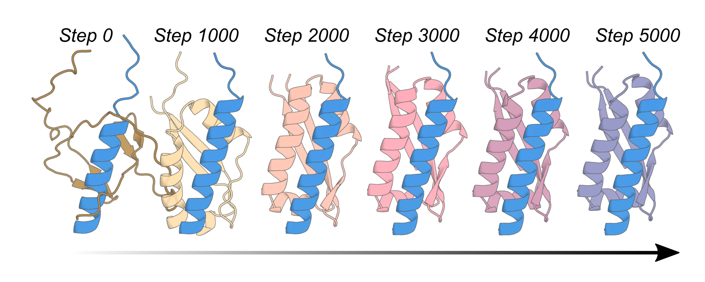

# AlphaFold2 Hallucination for Flexible Peptide Binding

<p align="center">
  
</p>

## Description

Code for generating binders to flexible peptides using Hallucination (Activation Maximisation) with AlphaFold2.

From [Vazquez-Torres, S., Leung, P.J.Y., Venkatesh, P. *et al*., De novo design of high-affinity binders of bioactive helical peptides, *Nature* 2023](https://www.nature.com/articles/s41586-023-06953-1).

The code is very heavily based upon, and uses much of the code from Basile Wicky and Lukas Milles' [Oligomer Hallucination](https://github.com/bwicky/oligomer_hallucination) code,
described in [Wicky, B.I.M., Milles, L.F. Courbet, A. *et al*., Hallucinating symmetric protein assemblies, *Science* 2022](https://www.science.org/doi/10.1126/science.add1964).

The underlying method relies on the [AlphaFold2 structure prediction network](https://github.com/google-deepmind/alphafold) from Google Deepmind,
described in [Jumper, J. *et al*., Highly accurate protein structure prediction with AlphaFold, *Nature* 2021](https://www.nature.com/articles/s41586-021-03819-2). 

Author: Joseph L. Watson; joewatchwell.

## Important Note

As demonstrated in the Nature article, binders can be generated to flexible peptides using RFdiffusion, which produces higher quality outputs and is several orders of magnitude more compute-efficient.
This code is provided for reproducibility purposes only.

[RFdiffusion](https://github.com/RosettaCommons/RFdiffusion) was originally described in [Watson, J.L., Juergens, D., Bennett, N.R., Trippe, B.L., Yim, J., Eisenach, H.E., Ahern W. *et al*.,
De novo design of protein structure and function with RFdiffusion, *Nature* 2023](https://www.nature.com/articles/s41586-023-06415-8).


----

# Table of contents

- [AlphaFold2 Hallucination for Flexible Peptide Binding](#alphafold2-hallucination-for-flexible-peptide-binding)
  - [Description](#description)
  - [Important Note](#important-note)
- [Table of contents](#table-of-contents)
- [Getting started / installation](#getting-started--installation)
- [Designing binders with AF2 Hallucination](#designing-binders-with-af2-hallucination)
  - [Modifying the loss parameters](#modifying-the-loss-parameters)
  - [Modifying Hallucination parameters](#modifying-hallucination-parameters)
- [Downstream steps](#downstream-steps)
- [Acknowledgements](#acknowledgements)

# Getting started / installation

You'll first need to clone the repository and its submodules:

```
git clone --recursive https://github.com/RosettaCommons/AF2_peptide_hallucination.git
```

Ensure that you have either [Anaconda or Miniconda](https://conda.io/projects/conda/en/latest/user-guide/install/index.html) installed.
You can then create a conda environment from the provided `.yml` file
```
conda env create -f env/SE3_PEPTIDE
conda activate SE3_PEPTIDE
```
By default, we clone the AlphaFold2 repository. If you already have AlphaFold2 installed locally, you can skip this step, but if not:

```
cd submodules/alpahafold
python setup.py install
```

# Designing binders with AF2 Hallucination

Once you have installed everything, you're ready to go!
The goal of this project was to be able to design binders to flexible peptides (helical peptides in the Nature article).
The flexibility of the peptides means that there is no single static structure that the peptides adopt, and hence, we want to be able to design binders to a variety of the possible states.
We leveraged the fact that AF2 is a structure prediction network to simultaneously design binders while predicting the structure of the peptide sequence.
Therefore, the only required input is a peptide sequence and the length of the binder you want to Hallucinate.
The arguments are provided through Hydra configs. The default configuration can be found in  `config/base.yaml`. You can either build a new config file, or specify arguments at the command line.

```
python run.py input.target_sequence=QEDIIRNIARHLAQVGDSMDRSIPPG input.binder_length=100
```

You probably want to change the output path:

```
output.out_dir=length_100_binders output.out_prefix=Bid_binders
```

By default, we won't override existing files, but this behaviour can be turned off:

```
output.cautious=False
```

## Modifying the loss parameters

For simplicity, the losses implemented in this repository are just those used to design binders in the Nature article, with very minor performance improvements.
The default weights on each loss, as defined in the config file, are those used in the article. These can be modified trivially however. At the command line, you could, for example, provide:

```
loss.plddt=5 loss.ptm=0
```
This would upweight the `plddt` loss (from its default value of 1) and turn off the `pTM` loss.

These losses are defined in `util/losses.py`. It is very simple to add additional losses, if you so desire.

## Modifying Hallucination parameters

The hallucination parameters are taken directly from the [Oligomer Hallucination](https://github.com/bwicky/oligomer_hallucination) repository. You can easily modify things like the Softmax temperature and half-life. For example:

```
hallucination.T_init=0.05 hallucination.half_life=500
```
Would start with a higher temperature (so higher chance of accepting a "bad" mutation) but a shorter half life (so this chance decays faster).

## Optimising an existing binder

You can also try to optimise an existing binder. Here, we provide a specific starting sequence (rather than generating a random one).

```
input.binder_sequence=EELTIEVRIEGVDPETAARIEAIFKSVWEPRAKKLSLEGQKALVEALARALVAALKEHGIDARVHVKLIKDGEVVHELEF
```

# Downstream steps

Once you have run some Hallucination trajectories, you'll want to do some downstream processing before ordering.
Following [Wicky, B.I.M., Milles, L.F., Courbet, A. *et al*., *Science* 2022](https://www.science.org/doi/10.1126/science.add1964), who noted that the sequences that AF2 Hallucination produces are generally insoluble,
in the Nature article we redesigned the sequence of the binders with [ProteinMPNN](https://github.com/dauparas/ProteinMPNN),
described in [Dauparas, J. *et al*, Robust deep learning–based protein sequence design using ProteinMPNN, *Science* 2022](https://www.science.org/doi/10.1126/science.add2187).

We then filtered these sequences based on AF2 pLDDT, pTM, RMSD to the design model, RMSD of the monomer to the binder model (without the peptide), and Rosetta ddg. 

# Acknowledgements

This work was made possible by the following separate libraries and packages:

* [Oligomer Hallucination](https://github.com/bwicky/oligomer_hallucination)
* [AlphaFold2](https://github.com/deepmind/alphafold)
* [ProteinMPNN](https://github.com/dauparas/ProteinMPNN)
*	[Rosetta](https://www.rosettacommons.org/software)
*	[PyRosetta](https://www.pyrosetta.org/)

Thank you all their contributors and maintainers!

# Get in touch

Questions and comments are welcome:

* Joseph Watson: [jwatson3@uw.edu](mailto:jwatson3@uw.edu)


